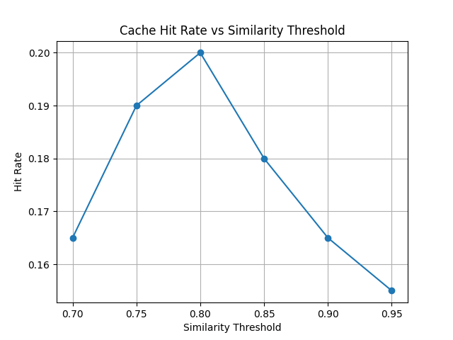
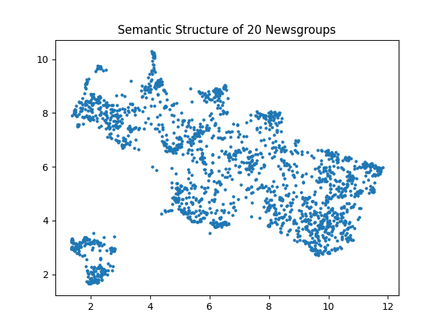

<div align="center">

# 🧠 Semantic Search System
### with Cluster-Aware Semantic Cache

*A lightweight semantic search engine that thinks before it searches.*

[](https://www.python.org/)
[](https://fastapi.tiangolo.com/)
[](https://github.com/facebookresearch/faiss)
[](https://www.docker.com/)
[](LICENSE)

---

*Built on the 20 Newsgroups dataset · Transformer embeddings · Fuzzy clustering · Zero-dependency cache*

</div>

---

## ✨ What Is This?

This project implements a **lightweight semantic search system** that goes beyond simple keyword matching. Instead of treating every query as unique, it recognizes when two differently phrased questions are asking the same thing — and reuses the answer.

The system combines:
- **Transformer-based embeddings** to understand meaning, not just words
- **Gaussian Mixture Models** for soft, probabilistic topic clustering
- **FAISS vector search** for fast nearest-neighbor document retrieval
- **A custom semantic cache** (no Redis, no external dependencies) that avoids redundant computation

> **"techniques for realistic 3D rendering"** and **"how to render photorealistic 3D graphics"** are the same question. This system knows that.

---

## 🚀 Quick Start

### Run Locally

```bash
# Install dependencies
pip install -r requirements.txt

# Start the API server
uvicorn api.main:app --reload
```

Then open **http://localhost:8000/docs** to explore the interactive API.

---

### Run with Docker

```bash
# Build the image
docker build -t semantic-cache .

# Run the container
docker run -p 8000:8000 semantic-cache
```

Open **http://localhost:8000/docs**

---

## 🏗️ System Architecture

```
                    ┌─────────────────┐
                    │   User Query    │
                    └────────┬────────┘
                             │
                    ┌────────▼────────┐
                    │  SentenceTrans- │
                    │  former Embed   │
                    └────────┬────────┘
                             │
                    ┌────────▼────────┐
                    │ Fuzzy Cluster   │
                    │ (GMM Lookup)    │
                    └────────┬────────┘
                             │
                    ┌────────▼────────┐
                    │ Semantic Cache  │
                    │  (Cosine Sim)   │
                    └───┬─────────┬───┘
                        │         │
               ┌────────▼───┐ ┌───▼────────────┐
               │ Cache HIT  │ │  Cache MISS     │
               │            │ │                 │
               │ ✅ Return  │ │ FAISS Vector    │
               │   Result   │ │ Search          │
               └────────────┘ │                 │
                              │ Store in Cache  │
                              │ → Return Result │
                              └─────────────────┘
```

The key insight: the cache doesn't match queries by text — it matches them **by meaning**, using cosine similarity on embeddings.

---

## 📚 Dataset

The system is built on the **20 Newsgroups dataset** — approximately **18,000 documents** across 20 discussion categories.

| Category Group | Topics |
|---|---|
| 🖥️ Technology | `comp.graphics`, `comp.os.ms-windows`, `comp.sys.ibm.pc`, `sci.crypt` |
| 🔭 Science | `sci.space`, `sci.med`, `sci.electronics` |
| ⚽ Sports | `rec.sport.hockey`, `rec.sport.baseball` |
| 🗳️ Politics | `talk.politics.guns`, `talk.politics.misc`, `talk.politics.mideast` |
| ✝️ Religion | `talk.religion.misc`, `soc.religion.christian`, `alt.atheism` |

The overlapping nature of these discussions makes it a strong testbed for fuzzy, probabilistic clustering.

---

## ⚙️ Core Components

### 🔢 Embeddings

```
Model: sentence-transformers/all-MiniLM-L6-v2
Output: 384-dimensional dense vectors
```

Every document and every query is encoded into a fixed-size semantic vector. Similar meanings produce nearby vectors — regardless of phrasing.

---

### 🗂️ Vector Database (FAISS)

```
Index: IndexFlatL2
Backend: Facebook AI Similarity Search
```

FAISS enables **fast nearest-neighbor lookup** across tens of thousands of document embeddings. On a cache miss, the system finds the most semantically similar documents in milliseconds.

---

### 🌀 Fuzzy Clustering (GMM)

Unlike hard clustering methods (KMeans), **Gaussian Mixture Models** assign **probability distributions** across clusters:

```
Query: "semiautomatic rifle regulations"

  → Politics    ████████████░░░░  0.52
  → Firearms    ████████░░░░░░░░  0.41
  → Other       █░░░░░░░░░░░░░░░  0.07
```

This reflects the real-world reality that discussions blend topics. The dominant cluster guides cache lookup for better precision.

---

### ⚡ Semantic Cache

A fully custom cache implementation — **no Redis, no external libraries**.

| Feature | Details |
|---|---|
| **Similarity Matching** | Cosine similarity on query embeddings |
| **Cluster Awareness** | Groups cache entries by dominant GMM cluster |
| **Eviction Policy** | LRU (Least Recently Used) |
| **Hit Condition** | Configurable similarity threshold |

When a new query arrives, the cache searches entries within the **same cluster** first, then applies a cosine similarity threshold to decide if a cached result is close enough to reuse.

---

## 📊 Experimental Results

### Cache Hit Rate vs. Similarity Threshold



The **optimal threshold is around 0.80** — high enough to avoid false matches, low enough to capture genuinely similar queries.

---

### Query Latency vs. Similarity Threshold


Lower thresholds allow more cache reuse, reducing the number of expensive FAISS lookups and cutting query latency significantly.

---

### Semantic Cluster Visualization (UMAP)



A UMAP projection of the full document embedding space reveals clean semantic groupings — space, graphics, politics, and religion emerge as distinct regions, with expected boundary overlap.

---

## 🔌 API Reference

### `POST /query`

Submit a natural language query and retrieve semantically relevant documents.

**Request**
```json
{
  "query": "techniques for realistic 3D rendering"
}
```

**Response**
```json
{
  "query": "techniques for realistic 3D rendering",
  "cache_hit": true,
  "similarity_score": 0.91,
  "dominant_cluster": 3,
  "result": "..."
}
```

---

### `GET /cache/stats`

Returns cache performance metrics.

```json
{
  "total_entries": 142,
  "hit_count": 87,
  "miss_count": 55,
  "hit_rate": 0.613
}
```

---

### `DELETE /cache`

Clears all cache entries and resets statistics.

---

## 📁 Project Structure

```
semantic-cache-system/
│
├── api/                    # FastAPI application & route handlers
├── cache/                  # Custom semantic cache implementation
├── clustering/             # GMM fuzzy clustering logic
├── embeddings/             # SentenceTransformer wrapper
├── preprocessing/          # Dataset loading & text cleaning
├── vectordb/               # FAISS index management
│
├── experiments/
│   ├── benchmark.py        # Hit rate & latency experiments
│   ├── plot_results.py     # Result visualization
│   ├── visualize_clusters.py  # UMAP cluster plots
│   └── results/            # Generated plots & metrics
│
├── Dockerfile
├── requirements.txt
└── README.md
```

---

## 🛠️ Configuration

Key parameters you can tune:

| Parameter | Default | Effect |
|---|---|---|
| `similarity_threshold` | `0.80` | Cache hit sensitivity |
| `cache_max_size` | `512` | Max cached entries (LRU) |
| `n_clusters` | `20` | GMM components |
| `top_k` | `5` | Documents returned per query |
| `embedding_model` | `all-MiniLM-L6-v2` | Sentence transformer model |

---

## 🧪 Running Experiments

```bash
# Run cache performance benchmark
python experiments/benchmark.py

# Generate hit rate & latency plots
python experiments/plot_results.py

# Visualize document clusters with UMAP
python experiments/visualize_clusters.py
```

---

## 🤝 Contributing

Contributions are welcome. To get started:

1. Fork the repository
2. Create a feature branch (`git checkout -b feature/your-feature`)
3. Commit your changes (`git commit -m 'Add your feature'`)
4. Push to the branch (`git push origin feature/your-feature`)
5. Open a Pull Request

---

## 📄 License

This project is licensed under the MIT License. See [LICENSE](LICENSE) for details.

---

<div align="center">


</div>
